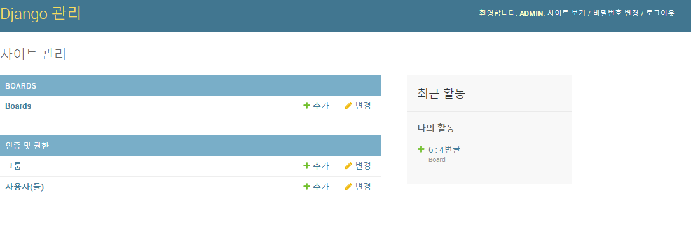
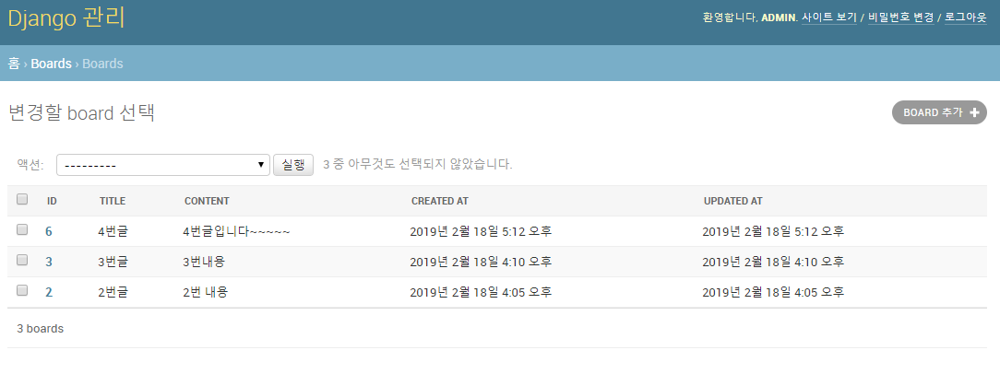
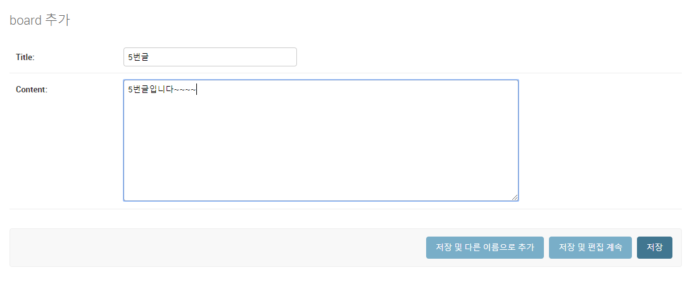

# Django CURD

## MODEL 기초


1. django_crud 프로젝트 만들기

   ```bash
   $ django-admin startproject django_crud
   ```

2. boards app 설정

   ```bash
   $ cd django_crud
   $ django-admin startapp boards
   ```

3.  app 등록

   ```python
   #  settings.py
   ALLOWED_HOSTS = ["*"]
   INSTALLED_APPS = [
       'django.contrib.admin',
       'django.contrib.auth',
       'django.contrib.contenttypes',
       'django.contrib.sessions',
       'django.contrib.messages',
       'django.contrib.staticfiles',
       'boards',
   ]
   LANGUAGE_CODE = 'ko-kr'
   
   TIME_ZONE = 'Asia/Seoul'
   ```

4. 최상단 django_crud 디렉토리 이름을 장고CRUD로 바꾸고 

5. Model 생성

   board/models.py 수정.=> ORM 설정

   ```python
   # board/models.py 
   
   from django.db import models
   
   # Create your models here.
   # class 명을 단수형으로 하기.
   class Board(models.Model):
       # column들을 어떻게 설정할건지 지정하기.
       # CharField는 몇글자 제한할건지 꼭 넣어주기
       title = models.CharField(max_length=10)
       # TextField는 글자 제한 없다.
       content = models.TextField()
       # 자동 날자 기입하도록 조건 추가.
       created_at = models.DateTimeField(auto_now_add=True)
       # 업데이트 될 때 마다 계속 변경되기 때문에 now를 적지 않는다.
       updated_at = models.DateTimeField(auto_now=True)
   ```

   - DB의 컬럼과, 어떠한 타입으로(글자 제한이나 어떠한 타입 정의 등) 정의할 것인지에 대해 `django.db.models`를 활용해서 `Board` 클래스를 만든다.

6.  bash창

   ```bash
    $ python manage.py makemigrations
   ```

   - migration 한다. : 내가 만들기 전. 클래스. 모델 파일을 마이그래이션으로 반영하는것은 우리가 디비에 어떤식으로 반영할건지를 지정.

   - 다시 말해, db의 스키마를 지정하는 것 처럼, DB에 반영하기 전에, 현재 등록된 APP의 `models.py`를 바탕으로 DB 설계도를 작성하는 것을 `마이그래이션 한다`고 한다.

   - `migrations`폴더에 `0001_initial.py` 파일들이 생성된다.

   - `id` : primary key는 기본적으로 처음 테이블 생성시 자동으로 만들어진다.

     ```python
     class Board(models.Model):
         id = models.AutoField(Primary_key=True)
         ...
     ```

     

7. 내가 원하는대로 잘 만들어졌는지 확인하기 위한 명령어. sqlmigrate로 만들었다. 만약 sqlite로 만들었으면 다른식으로 만들어진다.

   ```bash
   $ python manage.py sqlmigrate boards 0001
   ```

   out :

   ```
   BEGIN;
   --
   -- Create model Board
   --
   CREATE TABLE "boards_board" ("id" integer NOT NULL PRIMARY KEY AUTOINCREMENT, "title" varchar(10) NOT NULL, "content" text NOT NULL, "created_at" datetime NOT NULL);
   COMMIT;
   ```

8. DB에 반영 : migrate

   ```bash
   $ python manage.py migrate
   ```

   - 실제 쿼리문을 확인하는 방법

     ```bash
     $ python manage.py sqlmigrate boards 0001
     ```

     - App 이름(boards)와 migration 버전(0001, 0002, ...)으로 명령어를 입력하면, 실제 데이터 베이스에 적용되는 sql 쿼리를 확인할 수 있다.
     - `sqlmigrate` 명령어는 실제로 DB에 반영되지는 않는다. (단순 쿼리 확인)

## 장고 ORM 활용하기

> 시작하기에 앞서서 django shell에서 모델과 관련된 메소드를 활용하여 데이터베이스 조작하기

0. `django shell` 활용 하기 

   ```bash
   $ python manage.py shell
   ```

   - 이 경우에는 내가 활용할 모듈 혹은 파일을 직접 import 해야한다. 번거롭기 때문에 `django_extensions`을 깔아서 활용.

   django-extensions 설치

   ```bash
   $ pip install django-extensions
   ```

   - 해당 모듈을 활용하기 위해서는 `settings.py`에 APP 등록을 해야한다.

     ```python
     # settings.py
     INSTALLED_APPS = [
         'django.contrib.admin',
         'django.contrib.auth',
         'django.contrib.contenttypes',
         'django.contrib.sessions',
         'django.contrib.messages',
         'django.contrib.staticfiles',
         # app 위에 추가
         'django_extensions',
         'boards',
     ]
     ```

   - `shell_plus` 실행

     ```bash
     $ python manage.py shell_plus
     ```

     - 실행하면, `INSTALLED_APPS`에 설정된 내용들이 자동 import 된다.

1. 메소드 정리

   1. CRUD - C : Create

      ```python
      # 1번
      board = Board()
      board.title = '1번 제목'
      board.content = '1번 내용'
      board.save()
      
      # 2번
      board = Board(title='2번 제목', content='2번 내용')
      board.save()
      
      # 3번
      board = Board.objects.create(title='3번 제목', content='3번 내용')
      # 3번 같은 경우는 save를 하지 않아도 자동 저장된다.
      ```

      - `save()`

        ```python
        board = Board(title='2번 제목', content='2번 내용')
        board.id #=> None
        board.created_at #=> None
        board.save()
        board.id #=>1
        board.created_at #=> datetime.datetime(2019, 2, 18, 7, 5, 12, 420766, tzinfo=<UTC>)
        ```

        - `save()` 메소드를 호출 해야, DB에 저장된다. DB에 저장되면서 `id`와 `created_at`에 값이 부여된다.
        - `save()`전에 `full_clean()` 메소드를 통해 현제 board 객체가 validateion(검증)에 적합한지를 알아볼 수 있다.

      - bash창에서 알아보기

        ```bash
        >>> board = Board(title='안녕?', content='내용이야')
        >>> board
        <Board: Board object (None)>
        >>> board.title
        '안녕?'
        >>> board.save()
        >>> board
        # (1)은 아이디
        <Board: Board object (1)>
        
        
        
        >>> board = Board()
        >>> board.title = "2번글"
        >>> board.content = "2번 내용"
        >>> board.id
        >>> board.created_at
        # save를 해야지만 DB에 반영이 된다!!!!
        >>> board.save()
        >>> board.id
        2
        >>> board.created_at
        datetime.datetime(2019, 2, 18, 7, 5, 12, 420766, tzinfo=<UTC>)
        
        
        >>> board = Board.objects.create(title='3번글', content='3번내용')     
        >>> board
        <Board: 3 : 3번글>
        
        ```

   2. CURD - R : Read

      1. `all()`

         ```python
         boards = Board.objects.all()
         #=> <QuerySet [<Board: 1 : 안녕?>, <Board: 2 : 2번글>, <Board: 3 : 3번글>]>
         ```

      2. `get(pk=value)`

         ```python
         Board.objects.get(pk=1)
         # Board.objects.get(id=1)
         ```

         - `get()` 은 데이터베이스에 일치하는 값이 없으면, 오류가 발생.
         - 또한, 결과가 여러개의 값이면, 오류가 발생한다.
         - 따라서, `id` 즉, Primary Key에만 사용하자.
         - 리턴값은 **board 오브젝트**이다! (`filter()`, `all()`은 모두 queryset이 리턴된다.)

      3. `filter(column=Value)`

         ```python
         Board.objects.filter(title='안녕?')
         # => <QuerySet [<Board: 1 : 안녕?>]>
         Board.objects.filter(id=1)
         # => <QuerySet [<Board: 1 : 안녕?>]>
         # 더블언더스코어(__) 활용.(DB의 like)
         Board.objects.filter(title__contains='번글')
         # => <QuerySet [<Board: 2 : 2번글>, <Board: 3 : 3번글>]>
         ```

         - 데이터베이스에서 찾았을 때, 결과가 하나이더라도 리턴값은 QuerySet이다. 결과가 없어도 비어있는 QuerySet을 리턴한다.!

   3. CURD - D : Delete

      1. delete

         ```python
         board = Board.objects.get(pk=1)
         board.delete()
         ```

   4. CURD - U : update

      1. update

         ```python
         board = Board.objects.get(pk=1)
         board.title = "수정"
         board.save()
         ```

         - `save()` 메소드는 board 오브젝트에 id가 없을 때에는 값을 추가하고, 있으면 수정한다.

   5. 추가 메소드

      ```python
      # 정렬
      Board.objects.order_by('title') # 오름차순
      Board.objects.order_by('-title') # 내림차순
      
      # 특정 단어 기준 탐색
      Board.objects.filter(title__contains='글')	# 제목에 글이 들어간 모든 데이터
      Board.objects.filter(title__startswith='1') # 제목이 1로 시작하는 모든 데이터
      Board.objects.filter(title__endswith='글') # 제목이 글로 끝나는 모든 데이터
      
      >>> Board.objects.filter(title__endswith='글')[0]
      <Board: 2 : 2번글>
      >>> Board.objects.filter(title__endswith='글')[1]
      <Board: 3 : 3번글>
      ```


## admin 활용하기

1. `boards/admin.py`

   ```python
   from django.contrib import admin
   # admin.py에서 Board 클래스를 쓰려면 반드시 import 해야한다.
   # 명시적 상대 (.models : 현재디렉토리에 있는 models.py)
   from .models import Board
   # Register your models here.
   class BoardAdmin(admin.ModelAdmin):
       list_display = ['id', 'title', 'content', 'created_at', 'updated_at',]
   admin.site.register(Board, BoardAdmin)
   ```

   ```bash
   $ python managey createsuperuser
   사용자 이름 (leave blank to use 'ubuntu'): admin
   이메일 주소: 
   Password: 
   Password (again): 
   # email 주소 작성 및 password 작성. 비밀번호는 123123으로 작성했다.
   ```

   ```bash
   $ python manage.py runserver 0.0.0.0:8080
   ```

   

   

   

   